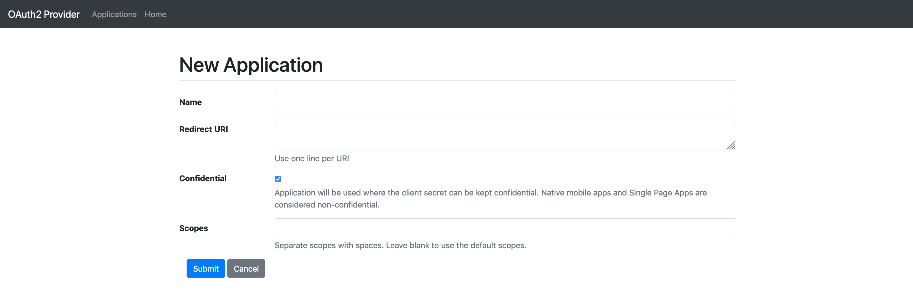
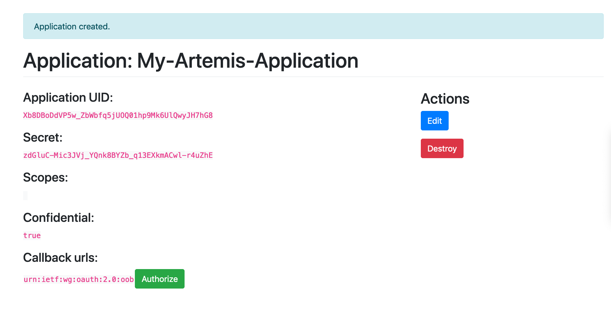

# Artemis API
> This is a basic python wrapper implementation for the Artemis API.


## Install

`pip install artemis_api_python`

## How to use 

You'll need to use OAuth 2.0 and the [Authorization Code Flow](https://auth0.com/docs/flows/authorization-code-flow) to authenticate and interact with the Artemis Ag API

Additional details regarding the Artemis API is also available on the [Artemis developer website](https://developer.artemisag.com/)

### Create an app and generate an authorization code

You'll first need to create an application through the Artemis portal then generate an authorization code.

One of your Artemis users (which you'll be using to interact with the API) will need access to the API.
If you’re not flagged as a developer account and you need to be, contact your Artemis representative or email [jdayton@artemisag.com](mailto:jdayton@artemisag.com) and we’ll help you get set up.

Then head to `Settings > API > OAuth 2.0` section and create an application:



Set the `Name` of the application, the `Redirect URI` as needed.
If you'd like to access your authorization code directly, you can add to the redirect URIs `urn:ietf:wg:oauth:2.0:oob` as an additional callback url to your OAuth application. Then press `Submit`

A new Application should now be created. The associated `Application UID` and `Secret` should also be displayed on screen (should be safely stored on your end)



Press `Authorize`, to generate an authorization code and store it on your end

### Setup Environment variables

You'll then need to set the following environment variables using the previously retrieved information:

- `ARTEMIS_OAUTH_APP_ID` = YOUR_APPLICATION_UUID
- `ARTEMIS_OAUTH_APP_SECRET` = YOUR_APPLICATION_SECRET
- `ARTEMIS_BASE_URI` = https://portal.artemisag.com

### Use the generated authorization code to retrieve a token:

Once the authorization code has been generated, for the first authentication, you can pass the authorization code when creating an `APIClient` instance. This will generate a token that will contain an `access_token`

```python
client = APIClient(auth_code="SOW6aFsut-bFVNKsBEPA1EDNrLjDnUseCLzAEjjKK6o")
```

The generated token should have the following format:
```
{'access_token': 'YOUR_ACCESS_TOKEN'
 'token_type': 'Bearer',
 'expires_in': 7200,
 'refresh_token': 'YOUR_REFRESH_TOKEN',
 'scope': ['default'],
 'created_at': 1614610952,
 'expires_at': 1614618152.409052}
```

### Refreshing a token manually

Since the `access_token` will have a limited duration, you'll need to refresh it. This can be done by passing the token when creating an `APIClient` to refresh it:

```python
client_refresh = APIClient(token=client.token)
```

The token information should then be updated:
```
{'access_token': 'YOUR_NEW_ACCESS_TOKEN',
 'token_type': 'Bearer',
 'expires_in': 7200,
 'refresh_token': 'YOUR_NEW_REFRESH_TOKEN',
 'scope': ['default'],
 'created_at': 1614614804,
 'expires_at': 1614622004.975017}
 ```
